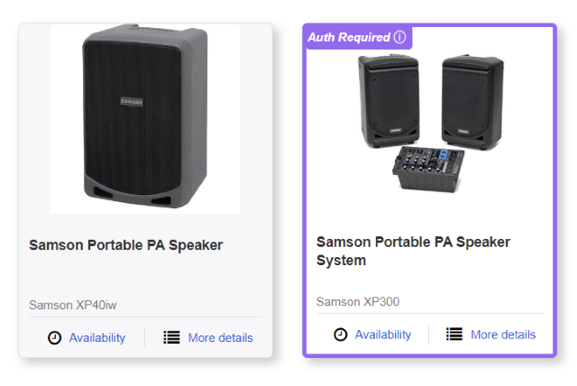
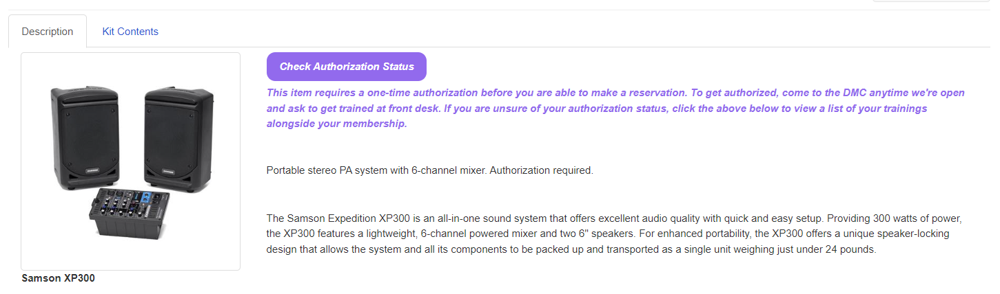
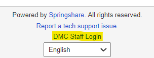

# LibCal-Website-Customization

This repository stores all the code for customizing the patron-facing LibCal interface for DMC BookIt. Below lists the current customizations and outlines how they are installed. See

## Customization List

### Check Membership Button


A button that links to the Power Apps membership status checker devloped by JHU IT. This is inserted on the homepage and opens the checker in a new tab.

### Authed Item Borders



Draws a purple border around items requring authorization. Includes a banner with an info icon that simply redirects to the item page.

### Authed Item Disclaimer



Inserts a text disclaimer about what "authorization" means. Includes a button to check authorization status. The button has style dependencies with the homepage membership button.

### Staff Login Text Change



Changes text of the DMC staff login link in the footer of all public pages. "Login to LibApps" is changed to "DMC Staff Login".

### Category Grids

[Currently in devlopment!]

Adds a grid of the available categories and subcategories. Each category has a collapsible dropdown. Dynamically resizes to accomodate mobile UI.

## Customization Table

| Customization Name      | CSS Injection? | JS Injection? | Homepage Editor HTML? |  |
| ----------------------- | :------------: | :-----------: | :-------------------: | - |
| Check Membership Button |  &nbsp;x[^1]  |              |           x           |  |
| Authed Item Borders     |       x       |       x       |                      |  |
| Authed Item Disclaimer  |       x       |       x       |                      |  |
| Staff Login Text Change |                |       x       |                      |  |
| Category Grids          |       x       |       x       |           x           |  |

[^1]: Relies on the CSS of *Authed Item Disclaimer*

## How to Implement New Customizations

### Coding Rules

Always follow these rules when developing any website customizations involving code:

1. Obtain ProStaff approval before making any public changes!
2. Save all of your code to this repository in an appropriate folder.
3. Use code comments diligently!
4. Add an author & description comment at the top, e.g.:
   ```
   /*
   Description: Adds a border around items requiring authorization
   Author: Dua Lipa (hotgurlsheet@gmail.com)
   */
   ```
5. Take a screenshot of what the changes look like, and save to `images/readme_images`
6. Add the image and a short description to the (Customization List)[#Customization-List] section of this readme file.
7. Add an entry in the (Customization Table)[#Customization-Table] of this readme file.
8. Follow the instructions below for implementation.

### Adding Homepage HTML elements

Most parts of the HTML for the public LibCal homepage can easily be edited using the native Rich-Text text editor native to the admin dashboard. To add custom HTML to the homepage:

1. Go to the [staff dashboard](https://jhu-dmc.libapps.com/libapps/login.php?site_id=23671&target=).
2. Click the ribbon tab `Admin` > `Look & Feel`.
3. Click the tab `Homepage Editor`.
4. Click edit icon (pencil) on specific block.
5. In the Rich-Text editor, click `Source` to reveal the HTML.
6. Paste in the HTML.
7. Click `Source` again to hide the HTML and preview the changes.
8. Click the `Save` button.
9. Test your code on the [public website](https://bookit.dmc.jhu.edu/)! Any changes are public to patrons immediately!

### Injecting Custom JS & CSS

Custom CSS and JavaScript can be used in order to:

* Change the public LibCal website on any page, rather than just the homepage
* Edit the homepage with more advanced featutes than HTML alone can allow
* Keep the homepage HTML free from lengthy `style="..."` attributes within tags

Custom CSS and JS that are injected into the head of every public LibCal page. LibCal is nice enough to natiely support this feature in the admin panel. This allows us to change pretty much anything we'd like. *Don't let your dreams be memes*...

To inject custom code:

1. First test your code locally! Any changes here are public to all patrons!!!
2. Go to the staff dashboard.
3. Clock the ribbon tab `Admin` > `Look & Feel`.
4. Scroll down to `Code Customizations`.
5. Paste the code in the custom code text box.
6. Wrap the code in the appropriate tags:

   **Note**: Each customization should be wrapped in ***separate tags!*** This makes it easier to understand what is what.

   * JS:  `<script>`  and  `</script>`
   * CSS:  `<style>` and `</style>`
7. Click the `save` button and ensure you see the `Sucess` message.

   * If you see `Error` you likely didn't change anything.
   * If you did indeed change something and still see the `Error` message, add a space somewhere random that won't break the code.
8. Test your code!!!!! Any changes are public to patrons immediately!
