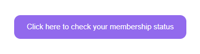

# LibCal-Website-Customization

This repository stores all of the code for customizing the patron-facing LibCal website for DMC BookIt at JHU. This `README.md` lists all of the current customizations, and outlines how to develop and install them.

# Current Customizations

## List of Customizations

### Check Membership Button



A button that links to the Power Apps membership status checker that was developed by JHU IT. This is inserted on the homepage and opens the checker in a new tab.

### Authed Item Borders


Draws a purple border around items requiring authorization. Includes a banner with an info icon that simply redirects to the item page to display the disclaimer.

### Authed Item Disclaimer


Inserts a text disclaimer about what "authorization" means. Includes a button to check your authorization status using the same HTML as the *Check Membership Button* and shares CSS dependencies.

### Staff Login Text Change


Changes text of the DMC staff login link in the footer of all public pages. "Login to LibApps" is changed to "DMC Staff Login". Not actually highlighted yellow, lol.

### Category Grids


Adds a grid of the available equipment categories and subcategories. Each category has a collapsible dropdown. Dynamically resizes to accommodate mobile UI.

### Scheduler Column Resizer


Edits the unnoticeable column resizer in the scheduler. Makes the bar wider & blue, and adds a handle. On mobile, it doesn't have a handle on item pages (due to bugs) so it makes the bar slightly wider.

### Autocollapse Other Items


On equipment page load, clicks the "Other items in this category" collpase button.

### Button Maker Templates Button Text


Replaces the "User Manual" button text with "Download Templates" for the three button makers.

## Table of Customizations

Below is a table describing the types of code each customization utilizes.

| Customization                 | CSS Injection? | JS Injection? | Homepage Editor HTML? |
| :---------------------------- | :------------: | :-----------: | :-------------------: |
| Check Membership Button       |  &nbsp;x[^1]  |              |           x           |
| Authed Item Borders           |       x       |       x       |                      |
| Authed Item Disclaimer        |       x       |       x       |                      |
| Staff Login Text Change       |                |       x       |                      |
| Category Grids                |       x       |       x       |           x           |
| Column Resizer                |       x       |       x       |                      |
| Autocollapse Other Items      |                |       x       |                      |
| Button Maker Templates Button |                |       x       |                      |

# Custom Code Development

## Coding Rules

Always follow these rules when developing any website customizations involving code:

1. Obtain ProStaff approval before implementing any public changes!
2. Save all of your code to this repository in an appropriate folder.
3. Use code comments diligently!
4. Add a description & author comment at the top of the code, e.g.
   ```
   // Description: Adds a border around items requiring authorization
   // Author: Dua Lipa (hotgurlsheet@gmail.com)
   ```
5. Take a screenshot of what the changes look like, and save it to this repo in  `/images/readme_images/`
6. Add the image and a short description to the [Customization List](#List-of-Customizations "Jump to list") section of this readme file.
7. Add a row in the [Customization Table](#Table-of-Customizations "Jump to table") of this readme file.
8. Follow the instructions below for implementation.

## Adding Homepage HTML elements

Most parts of the HTML for the public LibCal homepage can easily be edited using the Rich-Text editor native to the admin dashboard. To add custom HTML to the homepage:

1. Check that you followed ALL of the above [rules](#coding-rules "Jump to rules")!
2. Go to the [staff dashboard](https://jhu-dmc.libapps.com/libapps/login.php?site_id=23671&target= "Go to dashboard").
3. Click the ribbon tab `Admin` > `Look & Feel`.
4. Click the tab `Homepage Editor`.
5. Click edit icon (pencil) on a specific block.
6. In the Rich-Text editor ribbon, click `Source` to reveal the HTML.
7. Paste in the HTML.
8. Click `Source` again to hide the HTML and preview the changes.
9. Click the `Save` button.
10. Test your code on the [public website](https://bookit.dmc.jhu.edu/ "Go to public website")! Any changes are public to patrons immediately!

## Injecting Custom JS & CSS

Custom CSS and JavaScript can be used in order to:

* Change the public LibCal website on any page, rather than just the homepage
* Edit the homepage with more advanced features than HTML alone can allow
* Keep the HTML of the homepage free from lengthy `style="..."` attributes

Custom CSS and JS are injected into the head of *every* public LibCal page. LibCal is nice enough to natively support this feature in the admin panel. This allows us to change pretty much anything we'd like. *Don't let your dreams be memes*...

To inject custom code:

1. Check that you followed ALL of the above [rules](#coding-rules "Jump to rules")!
2. Go to the [staff dashboard](https://jhu-dmc.libapps.com/libapps/login.php?site_id=23671&target= "Go to dashboard").
3. Click the ribbon tab `Admin` > `Look & Feel`.
4. Scroll down to `Code Customizations`.
5. Paste the code in the custom code text box.
6. Wrap the code in the appropriate tags:
   - **Note**: Each customization should be wrapped in ***separate tags!*** This makes it easier to understand what is what.
   - JS:  `<script>`  and  `</script>`
   - CSS:  `<style>` and `</style>`
7. Click the `save` button and ensure you see the `Success` message.
   - If you see `Error` you likely didn't change anything.
   - If you did indeed change something and still see the `Error` message, add a space somewhere random that won't break the code.
8. Test your code on the [public website](https://bookit.dmc.jhu.edu/ "Go to public website")!!! All changes are public to patrons immediately!

## Code with Image Dependencies

If developing any custom code that adds images to the page, please follow the guidelines below:

1. Create an meaningful filename, as this is retained in the image URL.
2. Upload them to the [LibApps Image Manager](https://jhu-dmc.libapps.com/libapps/image_manager "Go to LibApps") to generate a static URL.
   1. Click the `Shared Library` button.
   2. Click the `Custom Code` folder.
   3. Click the chain icon under the uploaded image to obtain the URL.
3. For posterity, upload the images to this repo's `/images` folder.

[^1]: Relies on the CSS of *Authed Item Disclaimer*
